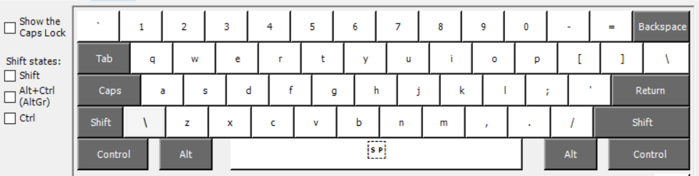
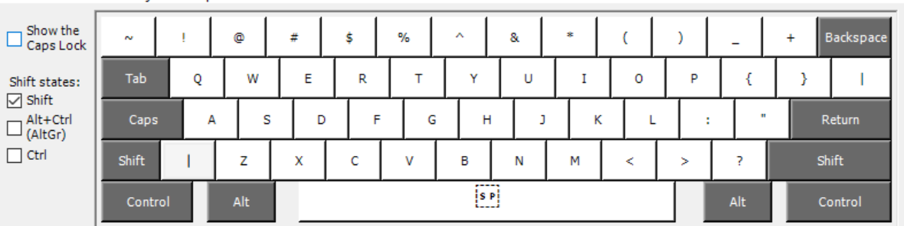

# German QWERTY

A custom **German QWERTY keyboard layout for Windows** designed for people who are comfortable with the standard QWERTY layout but don't want to switch to the German QWERTZ layout.

## The Problem

The standard German keyboard layout uses **QWERTZ** instead of **QWERTY**.

The most noticeable difference is that `Y` and `Z` are swapped:

```text
QWERTY → QWERTZ
```

For people who already type quickly using QWERTY, switching to QWERTZ can be frustrating and can significantly affect typing speed and muscle memory.

At the same time, typing German requires characters that aren't normally available on a standard US QWERTY keyboard:

- `ä` | `Ä`
- `ö` | `Ö`
- `ü` | `Ü`
- `ß` | `ß`

I wanted a keyboard layout that provides the best of both worlds:

> **Keep the familiar QWERTY layout while making German characters easily accessible.**

## The Solution

**German QWERTY** keeps the standard QWERTY keyboard layout and adds German characters using **AltGr**.

**Note**: `AltGr = alt + ctrl` or `ctrl + alt` the order does't matter.

### Lowercase

| Shortcut    | Character |
| ----------- | --------- |
| `AltGr + A` | `ä`       |
| `AltGr + S` | `ß`       |
| `AltGr + U` | `ü`       |
| `AltGr + O` | `ö`       |

### Uppercase

Hold **Shift + AltGr**:

| Shortcut            | Character |
| ------------------- | --------- |
| `AltGr + Shift + A` | `Ä`       |
| `AltGr + Shift + S` | `ẞ`       |
| `AltGr + Shift + U` | `Ü`       |
| `AltGr + Shift + O` | `Ö`       |

Everything else remains in its normal QWERTY position.

## No German Language Installation Required

One of the goals of this layout is to keep the installation as simple as possible.

**You do not need to install the German Windows language pack to use this keyboard layout.**

The custom keyboard layout itself can be installed and selected independently.

This is useful if you:

- Keep Windows in English
- Don't want to install additional language packs
- Only want German keyboard functionality
- Regularly switch between English, Persian, and German

## Installation

1. Download the latest release from the **Releases** section.
2. Run the provided installer.
3. Install the keyboard layout.
4. Open Windows keyboard/language settings.
5. Add/select **German QWERTY** as your keyboard layout.
6. Switch to it using:

```text
Win + Space
```

or

```
alt + shift
```

### Important: Restart Required

After installing the layout, **restart Windows before using the AltGr mappings**.

Windows may not properly load the custom `AltGr` mappings until after a restart.

If `AltGr + A/O/U/S` doesn't work immediately after installation, **restart your computer first**.

## Example

With the layout enabled, you can type:

```text
Ich möchte Deutsch lernen.
```

without changing from QWERTY to QWERTZ.

For example:

```text
möchte
```

can be typed using:

```text
m + AltGr + O + c + h + t + e
```

and:

```text
für
```

using:

```text
f + AltGr + U + r
```

## Intended Users

This layout is primarily intended for people who:

- Are already comfortable with QWERTY
- Want to type German regularly
- Don't want to learn QWERTZ
- Use a US/UK-style physical keyboard
- Want easy access to German special characters
- Use multiple languages such as English, Persian, and German

## Keyboard Layout

It is just like normal English QWERTY layout :


When you hold `AltGr` :


When you hold `AltGr + shift` you get capital :


When you just hold `shift` :


```text
AltGr layer:

AltGr + A → ä
AltGr + S → ß
AltGr + U → ü
AltGr + O → ö
```

## Why These Keys?

The German characters are placed on keys that are easy to remember:

```text
A → ä
O → ö
U → ü
S → ß
```

The umlauts are therefore directly associated with their corresponding base letters.

```text
A → Ä / ä
O → Ö / ö
U → Ü / ü
```

And `S → ß` provides a simple mnemonic for the sharp S.

## Building the Layout

This keyboard layout was created using:

**Microsoft Keyboard Layout Creator (MSKLC)**

The source files are included in this repository so the layout can be modified and rebuilt.

## How to install

1. You can download and extract then just run `setup.exe` file from relases of this [github page](https://github.com/Poya-Faraji/german-qwerty/releases/tag/v1.0.0)

2. Then you go windows Lanuage settings
3. Then select English/German click options
4. Once you are in Lanugae Options:
   - Under the keyboard click Add a keyboard
   - Then select QWERTY - GERMAN
5. Just make sure to restart you pc and select the added lanuguage using `win + space` or `alt + shift` and enjoy it.

## Project Status

This project was created primarily for personal use, but it is published for anyone who has the same problem and prefers **QWERTY over QWERTZ** when typing German.

Suggestions and improvements are welcome.

## License

This project is open source. See the `LICENSE` file for details.
